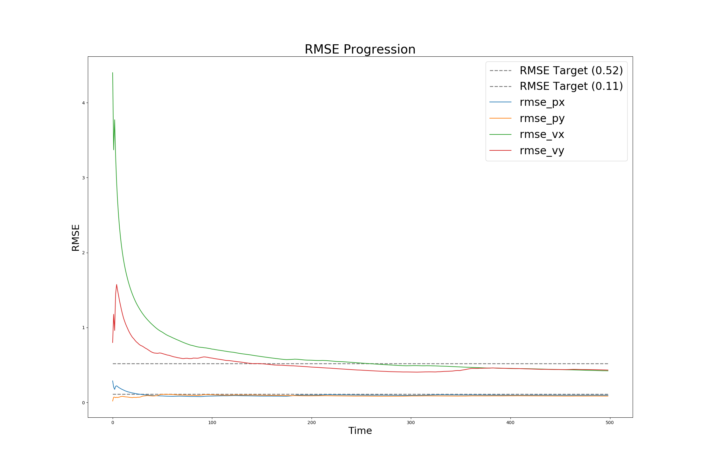

# Udacity Self Driving Car Nanodegree

## Term 2, Project 1 -- Extended Kalman Filter

### Name: Ciaran Murphy

### Date: 27-Jan-2018

---

## Introduction

The goal of this project is to implement an Extended Kalman Filter in C++. The
input data simulates Lidar and Radar sensor input to track an object (e.g.
bicycle) moving in a figure-of-eight pattern around the car. This input sensor
data is fed to the Kalman Filter implementation over a TCP socket and the
program then calculates an estimate of the location of the object.

In this write up, I will cover the points of the project
[rubric](https://review.udacity.com/#!/rubrics/748/view). 


## Compiling

* **Requirement**: *Your code should compile.*

The code can be compiled with no errors or warnings using the provided cmake
file in the project root directory. To compile, move to the root dir of the
project and execute:

```shell
mkdir build && cd build
cmake ..
make

```

This will create a file called `ExtendedKF` which is the main executable of the
program.


## Accuracy

* **Requirement**: *px, py, vx, vy output coordinates must have an RMSE <= [.11, .11,
0.52, 0.52]*

The RMSE values for the implementation are shown in the following plot.



The final values for RMSE are:

|Item | RMSE |
|-|------|
|px|0.096592|
|py|0.085317|
|vx|0.421975|
|vy|0.432503|


## Follows the Correct Algorithm

* **Requirement**: *The Sensor Fusion algorithm follows the general processing flow as
taught*

The implementation follows the lessons closely with most of the code taken
directly from the programming exercises. 


* **Requirement**: *The Kalman Filter algorithm handles the first measurements
  appropriately*

In the method `FusionEKF::ProcessMeasurement` of `FusionEKF.cpp` line number 65
starts a section to deal with the initial incoming measurements. 

```cpp
    if (!is_initialized_) {
        cout << "Initializing..." << endl;

        // first measurement
        ekf_.x_ = VectorXd(4);
        ekf_.x_ << 1, 1, 0.8, 0.8;

        if (measurement_pack.sensor_type_ == MeasurementPackage::RADAR) {
            // Convert radar from polar to cartesian coordinates and initialize state
            float rho = measurement_pack.raw_measurements_[0];
            float phi = measurement_pack.raw_measurements_[1];

            ekf_.x_(0) = rho*cos(phi); // x
            ekf_.x_(1) = rho*sin(phi); // y

        } else if (measurement_pack.sensor_type_ == MeasurementPackage::LASER) {
            // Lidar is already in cartesian, so just initialize state
            ekf_.x_(0) = measurement_pack.raw_measurements_(0); // x
            ekf_.x_(1) = measurement_pack.raw_measurements_(1); // y
        }

        // Initialise F with dt = 0
        ekf_.F_ = MatrixXd(4, 4);
        ekf_.F_ << 1, 0, 0, 0,
                   0, 1, 0, 0,
                   0, 0, 1, 0,
                   0, 0, 0, 1;

        previous_timestamp_ = measurement_pack.timestamp_;

        // done initializing, no need to predict or update
        is_initialized_ = true;
        return;
    }
```


* **Requriement**: *The Kalman Filter algorithm first predicts then updates*

Line 122 in `FusionEKF.cpp` starts the prediction step whereas line 157 starts
the update step.


* **Requirement**: *The Kalman Filter can handle radar and lidar measurements*

The code in the provided `main.cpp` file contains the parsing logic that
detects whether the incoming line item is Radar or Lidar data by checking the
1st char in the line (either an 'R' or an 'L'). A `measurement_pack` object is
then populated and the data sent on to `FusionEKF.cpp` for processing. On line
157 of `FusionEKF.cpp` the following logic splits between Lidar and Radar data
and triggers the code sections that set up the relevant matrices.

```cpp
    if (measurement_pack.sensor_type_ == MeasurementPackage::RADAR) {
        // Radar updates
        // set ekf_.H_ by setting to Hj which is the calculated 
        // jacobian (use the equation provided in tools.h)
        ekf_.H_ = tools.CalculateJacobian(ekf_.x_);
        // set ekf_.R_ by using the R_radar_
        ekf_.R_ = R_radar_;
        ekf_.UpdateEKF(measurement_pack.raw_measurements_);

    } else {
        // Laser updates
        ekf_.H_ = H_laser_;
        ekf_.R_ = R_laser_;
        ekf_.Update(measurement_pack.raw_measurements_);
    }
```


## Code Efficiency

* **Requirement**: *The algorithm should avoid unnecessary calculations*

The code is efficient and avoids unnecessary cycles while attempting to
be as readable as possible. 


